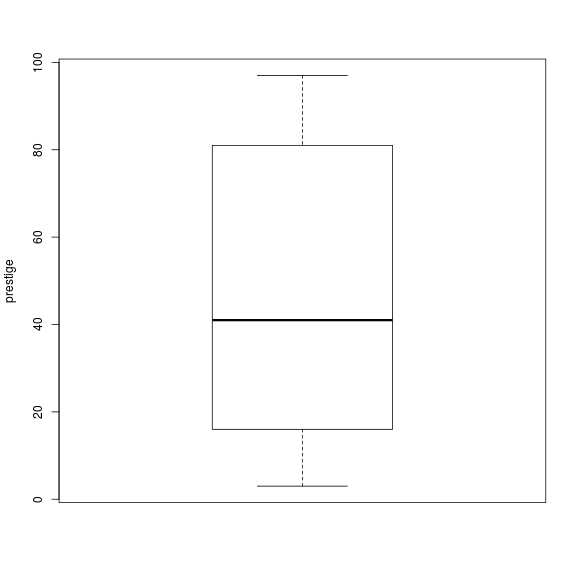
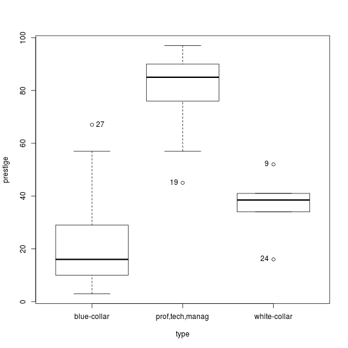
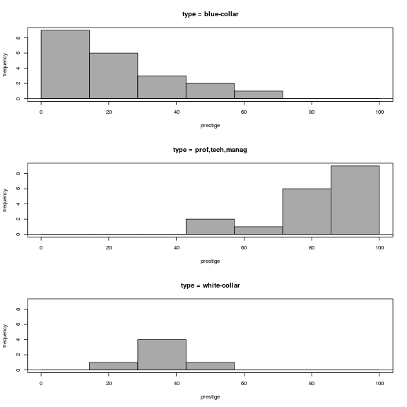

<!-- R Commander Markdown Template -->

Replace with Main Title
=======================

### Your Name

### 2019-09-17


```r
> Duncan <- read.table("/home/cart3ch/rwork/rprojects/badm_iimtrichy_18-20/data/Duncan.csv", 
+     header = TRUE, sep = ",", na.strings = "NA", dec = ".", strip.white = TRUE)
```


```r
> summary(Duncan)
```

```
             Name                 type        income        education     
 accountant    : 1   blue-collar    :21   Min.   : 7.00   Min.   :  7.00  
 architect     : 1   prof,tech,manag:18   1st Qu.:21.00   1st Qu.: 26.00  
 author        : 1   white-collar   : 6   Median :42.00   Median : 45.00  
 auto.repairman: 1                        Mean   :41.87   Mean   : 52.56  
 banker        : 1                        3rd Qu.:64.00   3rd Qu.: 84.00  
 barber        : 1                        Max.   :81.00   Max.   :100.00  
 (Other)       :39                                                        
    prestige    
 Min.   : 3.00  
 1st Qu.:16.00  
 Median :41.00  
 Mean   :47.69  
 3rd Qu.:81.00  
 Max.   :97.00  
                
```


```r
> cor(Duncan[, c("education", "income", "prestige")], use = "complete")
```

```
          education    income  prestige
education 1.0000000 0.7245124 0.8519156
income    0.7245124 1.0000000 0.8378014
prestige  0.8519156 0.8378014 1.0000000
```


```r
> cor(Duncan[, c("education", "income", "prestige")], use = "complete")
```

```
          education    income  prestige
education 1.0000000 0.7245124 0.8519156
income    0.7245124 1.0000000 0.8378014
prestige  0.8519156 0.8378014 1.0000000
```


```r
> Boxplot(~prestige, data = Duncan, id = list(method = "y"))
```




```r
> Boxplot(prestige ~ type, data = Duncan, id = list(method = "y"))
```



```
[1] "27" "19" "24" "9" 
```


```r
> with(Duncan, Hist(prestige, groups = type, scale = "frequency", breaks = "Sturges", 
+     col = "darkgray"))
```




